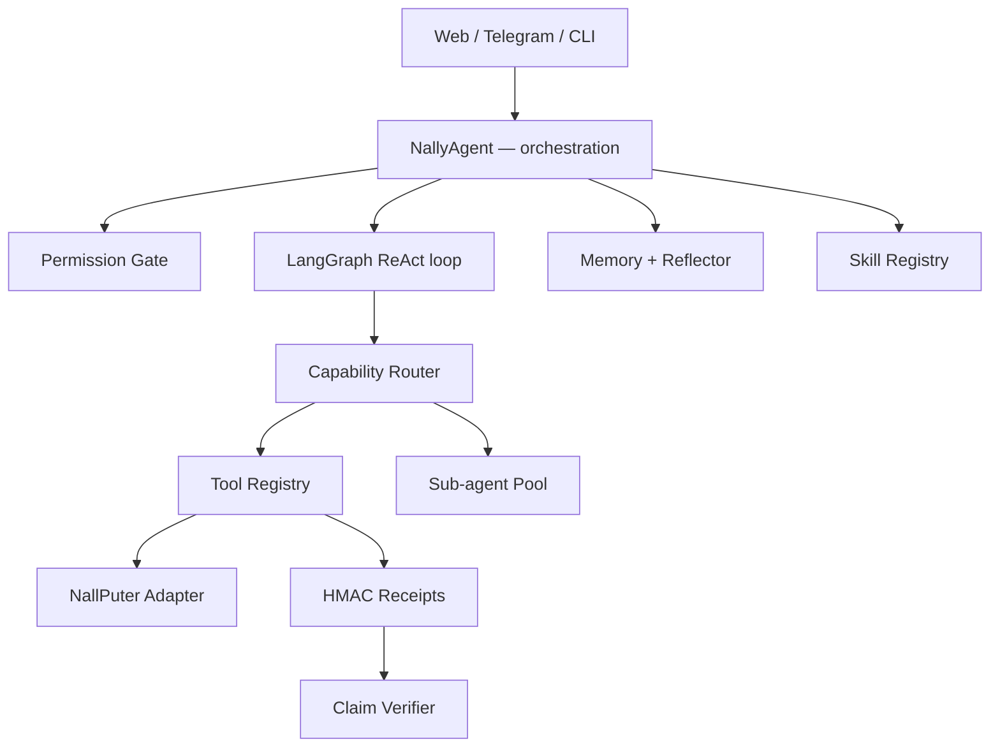

# N.A.L.L.Y


**N.A.L.L.Y is a self-hosted personal AI assistant — a LangGraph agent with its own tools, memory, and frontends for web, Telegram, and CLI.**

## Why Nally is different

| Differentiator | What it does |
|----------------|--------------|
| **Permission Gate** | Every tool call is evaluated against declarative `allow` / `ask` / `deny` rules. Destructive commands and deletes require explicit approval — skills can never override a `deny`. |
| **Tool Receipts** | Every tool execution produces an HMAC-signed, tamper-evident receipt (append-only JSONL). The audit trail is verifiable, not vibes. |
| **Claim Verifier** | Post-response checks cross-examine the model's claims against actual tool receipts — catching hallucinations without an LLM in the hot path. |
| **NallPuter** | A provider-neutral computer adapter (`ToolRegistry → ComputerAdapter → NallPuterClient`) with preflight, reconnect, and lifecycle management. Transport never leaks into tools. |
| **Capability Router** | Task-aware tool selection and sub-agent boundaries keep prompts small, routing deterministic, and parallel work contained. |

## Quick start

```bash
pip install -r requirements.txt
cp .env.example .env   # add your API keys
python main.py          # web UI at http://localhost:5000
```

```bash
python main.py --cli              # terminal mode
python main.py --telegram-only    # Telegram bot only
python main.py --engineer "TASK"  # autonomous engineering loop
```

## Architecture



Full design docs: [`docs/architecture/`](docs/architecture/) · Guides: [`docs/guides/`](docs/guides/) · Consolidation status: [`docs/STATUS.md`](docs/STATUS.md)

## Consolidation status

Active work happens on `refactor/nally-architecture-consolidation` — a Phase 1–5 hardening pass (controller, typed context, verification facade, memory authority, capability router) plus the NallPuter computer slices and deadline-authoritative execution budgets. See [`docs/STATUS.md`](docs/STATUS.md) for the phase-by-phase tracker. `master` stays deployable.

## Docs

- [Architecture](docs/architecture/ARCHITECTURE.md) · [Harness](docs/architecture/HARNESS.md) · [NallPuter contract](docs/architecture/COMPUTER.md)
- [API](docs/guides/API.md) · [Deployment](docs/guides/DEPLOYMENT.md) · [MCP](docs/guides/MCP_GUIDE.md) · [Memory](docs/guides/MEMORY.md) · [Testing](docs/guides/TESTING.md) · [Troubleshooting](docs/guides/TROUBLESHOOTING.md)
- [Changelog](CHANGELOG.md) · [Contributing](CONTRIBUTING.md) · [Security](SECURITY.md)

## License

Proprietary — see [LICENSE](LICENSE). Built by Clinton Onyedikachi Chukwuma (Klyntech).
